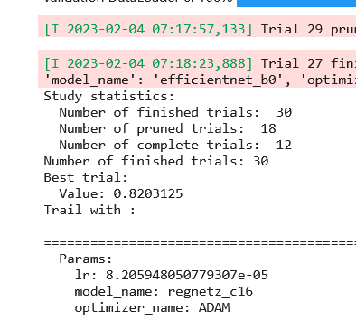

# HyperparamsTuning
Finding the best hyperparams using Optuna and pytorch lightening
- URL to the <a href='findingbesthyperparams-cnn-pytorchlightening-timm.ipynb'>notebook</a>

See the original Notebook on <a href="https://www.kaggle.com/code/greatcodes/findingbesthyperparams-cnn-pytorchlightening-timm/notebook?scriptVersionId=118853006">Kaggle </a>

## Hyperparams tuned
- Architectures 
    - resnet18
    - efficientnet_b0
    - regnetz_c16
- Optimisers
    - ADAM
    - SGD
- Learning Rate

## Best Params
- Architectures - regnetz_c16
- Optimisers - ADAM
- Learning Rate - 0.00008205

